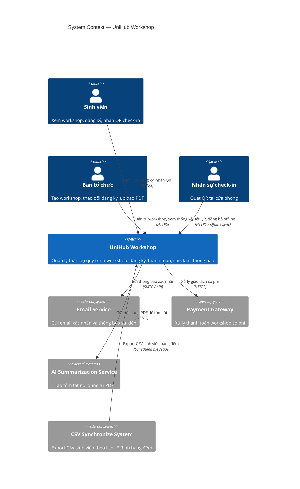
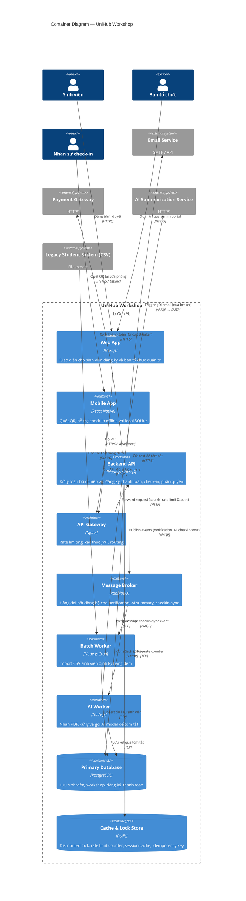

## 2. C4 Diagram

### 2.1 Level 1 — System Context

**Mô tả:**
Diagram mức cao nhất thể hiện **UniHub Workshop** như một hệ thống duy nhất (black box) trong bối cảnh môi trường của nó. Diagram làm rõ ai là người dùng (actors) và hệ thống bên ngoài (external systems) mà UniHub Workshop tương tác.

**Actors (Người dùng):**
- **Sinh viên (Student)**: Xem lịch workshop, đăng ký tham gia (miễn phí/có phí), nhận QR code và thông báo.
- **Ban tổ chức (Organizer)**: Tạo, chỉnh sửa, hủy workshop, quản lý thông tin, xem thống kê đăng ký và tải PDF để AI tóm tắt.
- **Nhân sự check-in (Check-in Staff)**: Quét mã QR để xác nhận sự tham dự tại chỗ (sử dụng mobile app).

**External Systems (Hệ thống bên ngoài):**
- **Email Service** (ví dụ: SendGrid, AWS SES hoặc SMTP server của trường): Gửi email xác nhận đăng ký và thông báo.
- **Payment Gateway** (ví dụ: VNPay, Momo, Stripe — giả lập trong đồ án): Xử lý thanh toán cho workshop có phí.
- **AI Summarization Service** (ví dụ: OpenAI GPT, Grok API, hoặc self-hosted LLM): Nhận text trích xuất từ PDF và trả về bản tóm tắt workshop.
- **Legacy Student Management System**: Cung cấp file CSV export định kỳ vào ban đêm (không có API hai chiều).
- **Future Notification Channels** (Telegram, Push Notification service): Thiết kế để dễ mở rộng.

**Interactions chính:**
- Sinh viên và Ban tổ chức tương tác với UniHub Workshop qua Web Application.
- Nhân sự check-in tương tác qua Mobile Application.
- UniHub Workshop gọi ra các external systems để xử lý thanh toán, gửi thông báo, tạo AI summary và nhập dữ liệu sinh viên từ CSV.

**Lý do thiết kế Level 1:**
Giúp các stakeholder (giảng viên, ban tổ chức trường) hiểu rõ phạm vi hệ thống và các điểm tích hợp bên ngoài mà không đi sâu vào công nghệ.

*(Ở đây bạn sẽ chèn diagram Level 1 – khuyến nghị vẽ bằng PlantUML hoặc C4-PlantUML)*

