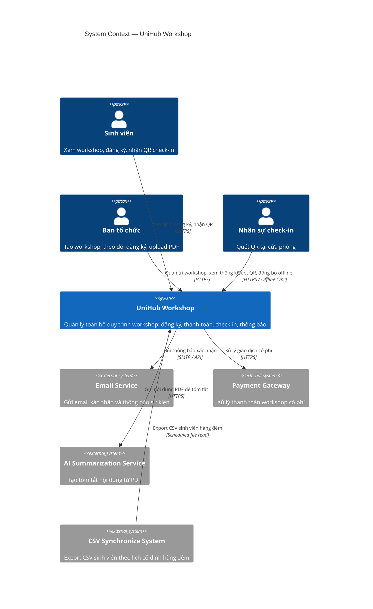
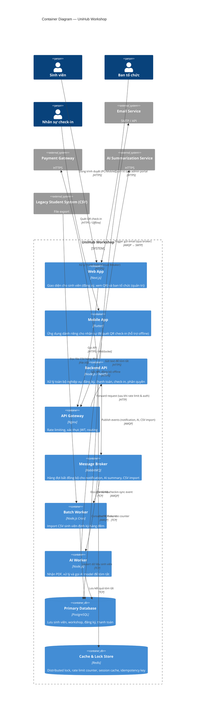

# Unihub Workshop - Technical Design 

## 1. Kiến trúc tổng thể

### 1.1 Architectural Style: Modular Monolith hướng tới Microservice trong tương lai
Unihub Workshop được thiết kế theo kiến trúc **Modular Monolith** trong giai đoạn đầu, với ranh giới module được phân tách rõ ràng để dễ dàng tách thành microservices độc lập khi cần mở rộng quy mô. Đồng thời, hệ thống tích hợp Event-Driven Architecture cho các luồng bất đồng bộ như thông báo, xử lý AI summary qua file PDF và đồng bộ file CSV.
 
| Tiêu chí             | Microservices thuần           | Modular Monolith (chọn) |
| ---------------------| -------------------           | ---------------- |
| Độ phức tạp vận hành | Cao (nhiều service, nhiều DB) | Thấp hơn, dễ deploy từ đầu |
| Ranh giới nghiệp     | Buộc phải rõ từ đầu           | Có thể điều chỉnh dần |
| Khả năng mở rộng     | Tốt ngay từ đầu               | Tốt sau khi tách module |
|Phù hợp nhóm nhỏ      | Khó                           | Phù hợp |


Các module có ranh giới nghiệp vụ rõ ràng (Workshop, Registration, Payment, Check-in, Notification, AI, CSV Import) giao tiếp với nhau qua **internal interface (function call)** trong cùng process. **Message broker (RabbitMQ)** chỉ dùng cho các tác vụ bất đồng bộ không nằm trên luồng request chính (Notification, AI Summary, CSV Import) — không dùng cho giao tiếp đồng bộ giữa các module.

### 1.2 Các thành phần chính
┌─────────────────────────────────────────────────────────────┐
│                         Clients                             │
│  [Web App - React/Next.js]  [Mobile App - Flutter]          │
└────────────────────┬────────────────────────────────────────┘
                     │ HTTPS / REST
┌────────────────────▼────────────────────────────────────────┐
│                    API Gateway (Nginx)                      │
│         Rate Limiting · Auth Token Validation · Routing     │
└────┬──────────────────────────────────────────────┬─────────┘
     │ HTTP (internal)                               │
┌────▼──────────────────────────────────┐    ┌──────▼──────────┐
│         Backend Application           │    │  Batch Worker   │
│  ┌─────────────────────────────────┐  │    │  (CSV Import)   │
│  │  Auth Module                    │  │    └─────────────────┘
│  │  Workshop Manager Module        │  │
│  │  Booking Module                 │  │
│  │  Notification Module            │  │   
│  │  Payment Module                 │  │   
│  │  CSV Database synchronize       │  │   
│  │  Report Module                  │  │   ┌─────────────────┐
│  │  Check-in Module                │  │   │ AI Worker       │
│  │  AI PDF Summary Module          │  │───► (PDF → Summary) │
│  └─────────────────────────────────┘  │   └─────────────────┘
└────┬───────────────────────┬──────────┘
     │                       │ Publish Events
┌────▼──────┐        ┌───────▼────────────────────┐
│ Database  │        │   Message Broker           │
│(PostgreSQL│        │   (RabbitMQ)               │
│+ Redis)   │        │  • notification.queue      │
└───────────┘        │  • ai_summary.generate     │

                     └──────────┬─────────────────┘
                                │ Consume
                     ┌──────────▼─────────────────┐
                     │   Notification Service     │
                     │  (Email · Push · Telegram) │
                     └────────────────────────────┘


1. Web App (Next.js)
Giao diện chính cho Sinh viên (xem lịch, đăng ký, tra cứu QR, thông báo) và Ban tổ chức (quản lý workshop, thống kê). Được thiết kế responsive để hoạt động tốt trên cả máy tính và điện thoại.

2. Mobile App (Flutter)
Ứng dụng dành cho Nhân sự check-in (Staff). Hỗ trợ quét mã QR, làm việc offline với SQLite và tự động đồng bộ khi có mạng.
Ứng dụng dành cho Sinh viên nhận thông báo (thông báo về workshop, QR để check-in)

3. API Gateway (Nginx + custom middleware hoặc Kong)
Tầng trung gian giữa client và backend, đảm nhiệm:

Rate Limiting (Token Bucket): giới hạn số request mỗi client trong khoảng thời gian, bảo vệ backend khỏi tải đột biến khi mở đăng ký.
Auth Token Validation: xác thực JWT trước khi forward request vào backend.
Routing: điều phối traffic đến đúng service.

4. Backend Application (Node.js)
Lõi xử lý nghiệp vụ, được tổ chức thành các module độc lập với ranh giới rõ ràng. Mỗi module chỉ expose interface công khai ra ngoài; các module khác không truy cập trực tiếp vào database của nhau.

| Module          | Trách nhiệm                              |
| ------------    | ------------------------------------------------ |
| Auth            | Login, Register, JWT Verify|
| Booking         | Xem và đăng ký workshop, xử lý tranh chấp chỗ ngồi, tải trọng tăng đột biến |
| Payment         |Xử lý thanh toán, Idempotency, 3DS Secure, Sandbox payment, thanh toán không ổn định  |
| Notification    | Thông báo xác nhận cho sinh viên qua web, app và email sau khi đặt chỗ ngồi workshop thành công, dễ dàng thêm kênh thông báo mới (Telegram, SMS) |
| Workshop manager| Chỉ dành cho admin, có thể tạo workshop mới, cập nhật thông tin, đổi phòng, đổi giờ hoặc hủy workshop |
| Report          | Chỉ dành cho admin nhằm thống kê các thông tin về workshop |
| Check-in        | Chỉ dành cho nhân sự sử dụng mobile app để quét mã QR từ app của sinh viên. Đảm bảo check-in tạm thời cho dù không có mạng và tự đồng bộ lại khi kết nối đã phục hồi |
| AI PDF Summary  |  Lấy file PDF từ workshop bất kì và dùng AI để tạo bản tóm tắt trên trang chi tiết workshop|
| CSV Database synchronize | Lấy dữ liệu từ file CSV được export từ hệ thống cũ để xác thực sinh viên khi đăng ký |

5. Message Broker (RabbitMQ)
Tách biệt các luồng xử lý bất đồng bộ khỏi luồng request chính, đảm bảo:

- Gửi thông báo sau đăng ký không làm chậm response trả về cho sinh viên.
- AI Summary xử lý nền sau khi ban tổ chức upload PDF.

> **Lưu ý:** Đồng bộ check-in từ mobile app gọi trực tiếp backend API (POST /checkin/sync-offline), không qua message broker. RabbitMQ chỉ phục vụ notification, AI summary và CSV import.

6. Cơ sở dữ liệu
- PostgreSQL (primary store): lưu toàn bộ dữ liệu quan hệ — sinh viên, workshop, đăng ký, lịch sử thanh toán. Đảm bảo ACID, phù hợp với yêu cầu nhất quán cao (đăng ký chỗ, thanh toán).
- Redis: phục vụ nhiều mục đích: distributed lock để chống race condition khi tranh chấp chỗ ngồi; cache danh sách workshop và số chỗ còn lại (giảm tải DB khi 12.000 sinh viên đọc đồng thời); lưu idempotency key cho thanh toán; lưu sliding window counter cho rate limiting.

7. Batch Worker (Node.js cron job)
Chạy theo lịch định kỳ (hàng đêm), đọc file CSV từ hệ thống cũ, xử lý dữ liệu sinh viên (validate, deduplicate, upsert vào PostgreSQL). Chạy độc lập, không ảnh hưởng đến luồng chính khi xảy ra lỗi.

8. AI Worker
Nhận event từ RabbitMQ khi có PDF mới được upload, gọi pipeline xử lý (tách nội dung, làm sạch văn bản, gọi AI model API) và lưu bản tóm tắt vào DB. Hoàn toàn bất đồng bộ.

### Cách các thành phần giao tiếp 
| Luồng | Giao thức |
| ----- | --------- |
|Client <-> API Gateway | HTTPS REST | 
|Mobile App <-> Check-in | HTTPS REST + offline queue |
|Backend -> Message Broker | AMQP (RabbitMQ) |
|Backend <-> Redis | Redis Protocol | 
|Backend <-> PostgreSQL | TCP |
|Batch Worker -> PostgreSQL | TCP |

### 1.3 Ảnh hưởng khi một thành phần gặp sự cố 
|Thành phần lõi | Ảnh hưởng | Cơ chế giảm thiểu |
| ------------- | --------- | ----------------- |
| Cổng thanh toán | Luồng đăng ký có phí bị gián đoạn | Circuit Breaker, workshop miễn phí và xem lịch vẫn hoạt động bình thường |
| RabbitMQ | Thông báo và AI summary bị trì hoãn | Request đăng ký vẫn thành công, notification retry khi broker được phục hồi |
| Redis | Rate limiting và distributed lock không hoạt động | Fallback về DB-level lock (chậm nhưng vẫn đúng) tăng nguy cơ tranh chấp chỗ ngồi nhưng không mất dữ liệu
| CSV Import | Dữ liệu sinh viên không được cập nhật đêm đó | Sinh viên đã có trong DB vẫn đăng ký bình thường, có sự cố thì log lỗi, alert, chạy thủ công |
| Mobile app mất mạng | Check-in không lên server ngay | Lưu dữ liệu local bằng SQLite, đồng bộ tự động khi có mạng trở lại |

---

## 2. C4 Diagram

### 2.1 Level 1 — System Context

**Mô tả:**
Diagram mức cao nhất thể hiện **UniHub Workshop** như một hệ thống duy nhất (black box) trong bối cảnh môi trường của nó. Diagram làm rõ ai là người dùng (actors) và hệ thống bên ngoài (external systems) mà UniHub Workshop tương tác.

**Actors (Người dùng):**
- **Sinh viên (Student)**: Xem lịch workshop, đăng ký tham gia (miễn phí/có phí), nhận QR code và thông báo.
- **Ban tổ chức (Organizer)**: Tạo, chỉnh sửa, hủy workshop, quản lý thông tin, xem thống kê đăng ký và tải PDF để AI tóm tắt.
- **Nhân sự check-in (Check-in Staff)**: Quét mã QR để xác nhận sự tham dự tại chỗ (sử dụng mobile app).

**External Systems (Hệ thống bên ngoài):**
- **Email Service** (ví dụ: SendGrid, AWS SES hoặc SMTP server của trường): Gửi email xác nhận đăng ký và thông báo.
- **Payment Gateway** (ví dụ: VNPay, Momo, Stripe — giả lập trong đồ án): Xử lý thanh toán cho workshop có phí.
- **AI Summarization Service** (ví dụ: OpenAI GPT, Grok API, hoặc self-hosted LLM): Nhận text trích xuất từ PDF và trả về bản tóm tắt workshop.
- **Legacy Student Management System**: Cung cấp file CSV export định kỳ vào ban đêm (không có API hai chiều).
- **Future Notification Channels** (Telegram, Push Notification service): Thiết kế để dễ mở rộng.

**Interactions chính:**
- Sinh viên và Ban tổ chức tương tác với UniHub Workshop qua Web Application (Responsive).
- Nhân sự check-in tương tác qua Mobile Application (Staff only).
- UniHub Workshop gọi ra các external systems để xử lý thanh toán, gửi thông báo, tạo AI summary và nhập dữ liệu sinh viên từ CSV.

**Lý do thiết kế Level 1:**
Giúp các stakeholder (giảng viên, ban tổ chức trường) hiểu rõ phạm vi hệ thống và các điểm tích hợp bên ngoài mà không đi sâu vào công nghệ.

*(Ở đây bạn sẽ chèn diagram Level 1 – khuyến nghị vẽ bằng PlantUML hoặc C4-PlantUML)*





---

## 3. High-Level Architecture Diagram
### 3.1 Tổng quan kiến trúc 4-layer
Hệ thống bao gồm 4 layer chính:

1. Client Layer
2. API Layer
3. Data Layer
4. Message Broker Layer

```
┌──────────────────────────────────────────────────────────────────┐
│                      CLIENT LAYER                                │
├──────────────────────────────────────────────────────────────────┤
│                                                                  │
│  ┌──────────────────────────────┐   ┌──────────────────────────┐ │
│  │  Web App (React/Next.js)     │   │ Mobile App (Flutter)     │ │
│  │  (Student & Admin)           │   │ (Staff Only)             │ │
│  │  - Browse/Register Workshop  │   │ - Staff Login            │ │
│  │  - Student QR Display        │   │ - QR Scan Check-in       │ │
│  │  - Admin Management Portal   │   │ - Offline Data Sync      │ │
│  └──────────────────────────────┘   └──────────────────────────┘ │
│                │                              │                  │
└────────────────┼──────────────────────────────┼──────────────────┘
                 │        HTTPS/REST            │
                 └──────────────┬───────────────┘
                                │
                ┌───────────────▼────────────────┐
                │     API GATEWAY (Nginx)        │
                ├────────────────────────────────┤
                │ - JWT Authentication           │
                │ - Rate Limiting (Token Bucket) │
                │ - Request/Response Logging     │
                └───────────────┬────────────────┘
                                │
┌───────────────────────────────┼──────────────────────────────────┐
│                   API SERVICES LAYER                             │
├───────────────────────────────┼──────────────────────────────────┤
│                               │                                  │
│  ┌────────────────┐  ┌──────────────┐  ┌──────────────────────┐  │
│  │ Auth Service   │  │ Workshop     │  │ Registration Service │  │
│  │                │  │ Service      │  │                      │  │
│  │ - Login        │  │              │  │ - Register Workshop  │  │
│  │ - Register     │  │ - CRUD       │  │ - Cancel Register    │  │
│  │ - JWT Verify   │  │ - List       │  │ - Conflict Detection │  │
│  └────────────────┘  │ - AI Summary │  └──────────────────────┘  │
│         │            │   Generator  │              │             │
│         └────────────┼──────────────┼──────────────┘             │
│                      │              │                            │
│  ┌──────────────────────────────┐  ┌──────────────┐  ┌────────────────────┐  │
│  │ Payment Service (SYNC)       │  │ Check-in     │  │ Notification       │  │
│  │                              │  │ Service      │  │ Service            │  │
│  │ - Called directly by Reg.Svc │  │              │  │                    │  │
│  │ - Call payment gateway sync  │  │ - Record     │  │ - Send via App     │  │
│  │ - Verify idempotency key     │  │ - Offline    │  │ - Send via Email   │  │
│  │ - Circuit breaker            │  │   Handling   │  │ - Send via Telegram│  │
│  │ - Return SUCCESS/FAILED      │  │ - Sync to DB │  │ - Queue Events     │  │
│  └──────────────────────────────┘  └──────────────┘  └────────────────────┘  │
│  ⚠ Registration CONFIRMED chỉ khi Payment trả về SUCCESS                     │
│  ⚠ Payment FAILED → Registration PENDING/FAILED, không giữ slot              │
│                               │         │                                    │
└───────────────────────────────┼─────────┼────────────────────────────────────┘
                                │         │
                                │ (Internal function calls)
                                │         │
         ┌──────────────────────▼─────────▼─────────┐
         │         Message Broker (RabbitMQ)        │
         ├──────────────────────────────────────────┤
         │ Queues:                                  │
         │ - notification.queue                     │
         │ - csv.import                             │
         │ - ai_summary.generate                    │
         │ (Removed: payment.process, payment.callback - now synchronous) │
         └─────────────┬──────────────────────────┬─┘
                       │                   │
┌──────────────────────┼───────────────────┼──────────────────────┐
│              DATA PERSISTENCE LAYER                             │
├──────────────────────┼───────────────────┼──────────────────────┤
│                      │                   │                      │
│  ┌──────────────┐   ┌▼───────────┐   ┌───▼─────────────┐        │
│  │ PostgreSQL   │   │ Redis      │   │ External APIs   │        │
│  │ (Primary DB) │   │ (Cache &   │   │                 │        │
│  │              │   │  Counters) │   │ - Payment       │        │
│  │ - Users      │   │            │   │   Gateway       │        │
│  │ - Workshops  │   │ - Counters │   │ - AI Model      │        │
│  │ - Registr.   │   │ - TTL      │   │ - Email SMTP    │        │
│  │ - Payments   │   │ - Lock     │   │ - SMS Service   │        │
│  │ - Check-ins  │   │ - Session  │   │                 │        │
│  │ - Notif.     │   │ - Rate     │   └─────────────────┘        │
│  │ - Audit logs │   │   Limits   │                              │
│  └──────────────┘   └────────────┘                              │
│                                                                 │
└─────────────────────────────────────────────────────────────────┘
```

### 3.2 Mô tả từng layer
#### 3.2.1 Client Layer

**Web App (React/Next.js)**
- Sinh viên: xem danh sách workshop, đăng ký, xem QR code (được thiết kế mobile-responsive).
- Ban tổ chức: tạo workshop, sửa room/time, xem thống kê, xem danh sách đăng ký.

**Mobile App (Flutter)**
- Nhân sự (Staff): đăng nhập và thực hiện quét QR code để check-in.
- Hỗ trợ offline mode: SQLite local database lưu valid QR list cho workshop.
- Khi mất mạng: check-in được ghi nhận local.
- Khi có mạng: tự động sync với server.

#### 3.2.2 API Gateway

Chịu trách nhiệm:
- **JWT Authentication**: Verify token, extract user info
- **Rate Limiting**: Dùng Token Bucket để chống burst (120,000 user)
- **Request/Response Logging**: Audit trail, debugging

#### 3.2.3 Backend API (Service-based)

**Auth Service**
- Login/Register với JWT token
- Token refresh

**Workshop Service**
- GET /workshops (danh sách workshop)
- GET /workshops/{id} (chi tiết workshop)
- GET /workshops/{id}/participants (lấy số lượng sinh viên đăng ký - admin)
- POST /workshops (tạo workshop - admin)
- PUT /workshops/{id} (sửa workshop - admin)
- DELETE /workshops/{id} (hủy workshop - admin)
- AI Summary generator (consume từ message queue)

**Registration Service**
- POST /register (sinh viên đăng ký)
- GET /my-registrations (xem những đơn đăng ký của mình)
- POST /registrations/{id}/cancel (hủy đơn)
- Xử lý race condition: 2 user cùng đăng ký 1 chỗ cuối cùng
- Gọi **Payment Service trực tiếp (đồng bộ)** trước khi xác nhận đăng ký
- Registration chỉ chuyển sang trạng thái `CONFIRMED` khi Payment trả về `SUCCESS`
- Payment thất bại → Registration ở trạng thái `FAILED`, không giữ slot
- Sau khi CONFIRMED, gửi event tới message broker để notification service gửi email/push

**Payment Service**
- Được gọi **trực tiếp (đồng bộ)** từ Registration Service qua function call nội bộ (cùng process)
- Gọi payment gateway và chờ kết quả, trả về `SUCCESS` hoặc `FAILED` ngay trong cùng request
- Verify idempotency key trước khi gọi gateway (tránh double charge khi retry)
- Xử lý timeout: nếu gateway không phản hồi → giữ trạng thái `PENDING`, worker reconcile với gateway sau. Không kết luận `FAILED` ngay khi chưa biết gateway đã charge hay chưa.
- Circuit breaker: nếu gateway fail nhiều lần → OPEN, trả về lỗi ngay (không gọi gateway)
- Graceful degradation: khi gateway down, free workshop vẫn available (bypass payment)

**Check-in Service**
- POST /checkin (quét QR online)
- POST /checkin/sync-offline (đồng bộ check-in khi offline)
- Xử lý deduplication: QR code scan 2 lần → chỉ record 1 lần

**Notification Service**
- Consume event từ message queue (notification.queue)
- Gửi push notification qua app
- Gửi email qua SMTP

#### 3.2.4 Message Broker Layer

**RabbitMQ** - xử lý asynchronous tasks

> **Lưu ý**: `payment.process` và `payment.callback` đã bị loại bỏ. Payment giờ là **đồng bộ** — Registration Module gọi trực tiếp Payment Module qua internal function call và chờ kết quả trước khi xác nhận đăng ký.

**Queues:**
- `notification.queue` - event sources → notification service consume
- `csv.import` - scheduled task → batch worker consume
- `ai_summary.generate` - workshop service → AI service consume

#### 3.2.5 Data Persistence Layer

**PostgreSQL (Primary Database)**
- Lưu tất cả dữ liệu persistent
- ACID transactions → đảm bảo consistency

**Redis (Cache + Counters + Locks)**
- **Counters**: `workshop:{id}:seats_available` - cache đọc nhanh số chỗ còn lại (DB là source of truth)
- **Locks**: `lock:workshop:{id}:register` - distributed lock (hoặc dùng DB row locking `SELECT ... FOR UPDATE`)
- **Rate Limiting**: `ratelimit:ip:{ip}:tokens` - token bucket counter
- **Idempotency**: `idempotent:payment:{uuid}` - cache payment result 24h
- **Refresh Token Blacklist**: `jwt:blacklist:{jti}` - revoke refresh token khi logout

**External APIs**
- Payment Gateway (3rd party)
- AI Model API (OpenAI, Claude, etc.)
- Email SMTP Server

---

## 4. Thiết kế cơ sở dữ liệu

### 4.1 Lựa chọn công nghệ

**PostgreSQL**: Lưu dữ liệu persistent
- Ưu điểm: ACID transactions, strong consistency, complex queries
- Dùng cho: users, workshops, registrations, payments, check-ins, notifications, audit logs

**Redis**: Cache + Counters + Locks
- Ưu điểm: Ultra-fast atomic operations, TTL support
- Dùng cho: seat counters, distributed locks, rate limiting, idempotency cache

### 4.2 Database Schema

#### 4.2.1 Users Table

```sql
CREATE TABLE users (
    id UUID PRIMARY KEY DEFAULT gen_random_uuid(),
    student_id VARCHAR(50) UNIQUE NOT NULL,
    full_name VARCHAR(255) NOT NULL,
    email VARCHAR(255) UNIQUE NOT NULL,
    phone VARCHAR(20),
    password_hash VARCHAR(255),
    role VARCHAR(20) NOT NULL DEFAULT 'student'
        CHECK (role IN ('student', 'admin', 'staff')),
    is_active BOOLEAN DEFAULT TRUE,
    created_at TIMESTAMP DEFAULT CURRENT_TIMESTAMP,
    updated_at TIMESTAMP DEFAULT CURRENT_TIMESTAMP
);

-- Indexes tách riêng (PostgreSQL không hỗ trợ INDEX trong CREATE TABLE)
CREATE INDEX idx_users_role ON users(role);
-- student_id và email đã có index tự động qua UNIQUE constraint

COMMENT ON TABLE users IS 'Lưu thông tin tất cả users trong hệ thống';
COMMENT ON COLUMN users.student_id IS 'ID sinh viên từ hệ thống cũ (unique key)';
COMMENT ON COLUMN users.role IS 'student: sinh viên; admin: ban tổ chức; staff: nhân sự check-in';
COMMENT ON COLUMN users.password_hash IS 'Dùng bcrypt, salt 10 rounds';
```

#### 4.2.2 Workshops Table

```sql
CREATE TABLE workshops (
    id UUID PRIMARY KEY DEFAULT gen_random_uuid(),
    title VARCHAR(255) NOT NULL,
    description TEXT,
    speaker VARCHAR(255),
    room VARCHAR(100),
    capacity INT NOT NULL CHECK (capacity > 0),
    start_time TIMESTAMP NOT NULL,
    end_time TIMESTAMP NOT NULL,
    is_paid BOOLEAN DEFAULT FALSE,
    price DECIMAL(10, 2) CHECK (price >= 0),
    status VARCHAR(20) NOT NULL DEFAULT 'active'
        CHECK (status IN ('active', 'cancelled', 'completed')),
    registration_open_at TIMESTAMP NOT NULL,
    registration_close_at TIMESTAMP NOT NULL,
    created_by UUID NOT NULL REFERENCES users(id),
    created_at TIMESTAMP DEFAULT CURRENT_TIMESTAMP,
    updated_at TIMESTAMP DEFAULT CURRENT_TIMESTAMP,
    
    CHECK (end_time > start_time),
    CHECK (registration_close_at IS NULL OR registration_close_at > registration_open_at)
);

-- Indexes tách riêng
CREATE INDEX idx_workshops_status ON workshops(status);
CREATE INDEX idx_workshops_start_time ON workshops(start_time);
CREATE INDEX idx_workshops_is_paid ON workshops(is_paid);
-- Index cho foreign key (PostgreSQL không tự tạo index cho FK)
CREATE INDEX idx_workshops_created_by ON workshops(created_by);

COMMENT ON TABLE workshops IS 'Lưu thông tin workshop/sự kiện';
COMMENT ON COLUMN workshops.capacity IS 'Số chỗ ngồi tối đa';
COMMENT ON COLUMN workshops.is_paid IS 'TRUE: có phí; FALSE: miễn phí';
COMMENT ON COLUMN workshops.status IS 'active: có thể đăng ký; cancelled: đã hủy; completed: đã kết thúc';
COMMENT ON COLUMN workshops.price IS 'Giá tiền workshop (VND)';
```

#### 4.2.3 Registrations Table

```sql
CREATE TABLE registrations (
    id UUID PRIMARY KEY DEFAULT gen_random_uuid(),
    user_id UUID NOT NULL REFERENCES users(id) ON DELETE CASCADE,
    workshop_id UUID NOT NULL REFERENCES workshops(id) ON DELETE CASCADE,
    status VARCHAR(20) NOT NULL DEFAULT 'pending'
        CHECK (status IN ('pending', 'confirmed', 'cancelled', 'no_show', 'failed')),
    qr_code VARCHAR(255) UNIQUE,  -- NULL khi pending, chỉ sinh khi confirmed
    qr_code_generated_at TIMESTAMP,
    created_at TIMESTAMP DEFAULT CURRENT_TIMESTAMP,
    updated_at TIMESTAMP DEFAULT CURRENT_TIMESTAMP,
    
    UNIQUE(user_id, workshop_id)
);

-- Indexes tách riêng
CREATE INDEX idx_registrations_status ON registrations(status);
-- Index cho foreign keys (PostgreSQL KHÔNG tự tạo index cho FK)
CREATE INDEX idx_registrations_user_id ON registrations(user_id);
CREATE INDEX idx_registrations_workshop_id ON registrations(workshop_id);
-- qr_code đã có index tự động qua UNIQUE constraint

COMMENT ON TABLE registrations IS 'Lưu thông tin đăng ký của sinh viên cho workshop';
COMMENT ON COLUMN registrations.status IS 'pending: chưa thanh toán (paid workshop); confirmed: đã xác nhận; cancelled: hủy; no_show: không đến; failed: thanh toán thất bại';
COMMENT ON COLUMN registrations.qr_code IS 'Unique QR code dùng cho check-in, chỉ được sinh khi status = confirmed';
COMMENT ON CONSTRAINT registrations_user_id_workshop_id_key ON registrations IS 'Đảm bảo 1 user không đăng ký cùng workshop 2 lần';
```

**Tại sao cần UNIQUE(user_id, workshop_id)?**
- Prevent duplicate registration từ user click register 2 lần
- Database constraint làm lớp thứ 2 defense (lớp thứ 1 là application logic)

#### 4.2.4 Payments Table

```sql
CREATE TABLE payments (
    id UUID PRIMARY KEY DEFAULT gen_random_uuid(),
    registration_id UUID NOT NULL UNIQUE REFERENCES registrations(id) ON DELETE CASCADE,
    user_id UUID NOT NULL REFERENCES users(id),
    amount DECIMAL(10, 2) NOT NULL CHECK (amount > 0),
    currency VARCHAR(3) DEFAULT 'VND',
    status VARCHAR(20) NOT NULL DEFAULT 'pending'
        CHECK (status IN ('pending', 'processing', 'success', 'failed', 'refunded')),
    payment_method VARCHAR(50),
    transaction_id VARCHAR(255),
    idempotency_key VARCHAR(255) UNIQUE NOT NULL,
    gateway_response JSONB,
    error_message TEXT,
    attempted_at TIMESTAMP,
    completed_at TIMESTAMP,
    created_at TIMESTAMP DEFAULT CURRENT_TIMESTAMP,
    updated_at TIMESTAMP DEFAULT CURRENT_TIMESTAMP
);

-- Indexes tách riêng
CREATE INDEX idx_payments_status ON payments(status);
CREATE INDEX idx_payments_created_at ON payments(created_at);
-- Index cho foreign keys (PostgreSQL KHÔNG tự tạo index cho FK)
CREATE INDEX idx_payments_user_id ON payments(user_id);
-- registration_id và idempotency_key đã có index tự động qua UNIQUE constraint

COMMENT ON TABLE payments IS 'Lưu thông tin giao dịch thanh toán';
COMMENT ON COLUMN payments.idempotency_key IS 'Dùng để chống trừ tiền 2 lần: user click register 2 lần → same key → gateway chỉ charge 1 lần';
COMMENT ON COLUMN payments.gateway_response IS 'JSON response từ payment gateway (include transaction details)';
COMMENT ON COLUMN payments.status IS 'pending: chưa xử lý; processing: đang xử lý; success: thành công; failed: thất bại; refunded: hoàn tiền';
```

**Tại sao cần idempotency_key?**
- Chống double-charge: user bấm "Thanh toán" 2 lần → 2 requests gửi tới server
- Server check Redis: idempotent:payment:{key} → nếu hit → return cached result (không charge lần 2)
- Nếu miss → call payment gateway → save result to Redis (TTL: 24h)

#### 4.2.5 Check-ins Table

```sql
CREATE TABLE checkins (
    id UUID PRIMARY KEY DEFAULT gen_random_uuid(),
    registration_id UUID NOT NULL UNIQUE REFERENCES registrations(id) ON DELETE CASCADE,
    user_id UUID NOT NULL REFERENCES users(id),
    workshop_id UUID NOT NULL REFERENCES workshops(id),
    checkin_time TIMESTAMP NOT NULL,
    device_id VARCHAR(255),
    location VARCHAR(100),
    created_at TIMESTAMP DEFAULT CURRENT_TIMESTAMP
);

-- Indexes tách riêng
CREATE INDEX idx_checkins_checkin_time ON checkins(checkin_time);
-- Index cho foreign keys (PostgreSQL KHÔNG tự tạo index cho FK)
CREATE INDEX idx_checkins_user_id ON checkins(user_id);
CREATE INDEX idx_checkins_workshop_id ON checkins(workshop_id);
-- registration_id đã có index tự động qua UNIQUE constraint

COMMENT ON TABLE checkins IS 'Lưu thông tin check-in của sinh viên (chỉ chứa dữ liệu đã được server xác nhận)';
COMMENT ON COLUMN checkins.device_id IS 'Device ID của mobile app, dùng để track thiết bị check-in';
COMMENT ON CONSTRAINT checkins_registration_id_key ON checkins IS 'Mỗi registration chỉ có 1 check-in record (one-to-one)';
```

> **Lưu ý:** Cột `is_synced` và `synced_at` đã được loại bỏ khỏi bảng `checkins` trên server. Trạng thái sync là logic thuộc về mobile app local queue (SQLite), không phải server DB. Khi dữ liệu đã xuất hiện trong bảng `checkins` trên server, nó đã được xác nhận.

#### 4.2.6 Notifications Table

```sql
CREATE TABLE notifications (
    id UUID PRIMARY KEY DEFAULT gen_random_uuid(),
    user_id UUID NOT NULL REFERENCES users(id) ON DELETE CASCADE,
    registration_id UUID REFERENCES registrations(id) ON DELETE SET NULL,
    type VARCHAR(50) NOT NULL
        CHECK (type IN ('registration_confirmed', 'payment_success', 'payment_failed', 'workshop_cancelled', 'reminder', 'checkin_success')),
    content TEXT NOT NULL,
    status VARCHAR(20) NOT NULL DEFAULT 'pending'
        CHECK (status IN ('pending', 'sent', 'failed', 'retrying')),
    channels JSONB DEFAULT '["app"]'::jsonb,
    retry_count INT DEFAULT 0,
    last_retry_at TIMESTAMP,
    created_at TIMESTAMP DEFAULT CURRENT_TIMESTAMP,
    updated_at TIMESTAMP DEFAULT CURRENT_TIMESTAMP
);

-- Indexes tách riêng
CREATE INDEX idx_notifications_status ON notifications(status);
CREATE INDEX idx_notifications_type ON notifications(type);
CREATE INDEX idx_notifications_created_at ON notifications(created_at);
-- Index cho foreign keys (PostgreSQL KHÔNG tự tạo index cho FK)
CREATE INDEX idx_notifications_user_id ON notifications(user_id);
CREATE INDEX idx_notifications_registration_id ON notifications(registration_id);

COMMENT ON TABLE notifications IS 'Lưu các thông báo cần gửi cho users';
COMMENT ON COLUMN notifications.channels IS 'JSON array: ["app", "email", "sms"] - chỉ những channel đã chọn';
COMMENT ON COLUMN notifications.retry_count IS 'Số lần đã retry (max 3 lần trước give up)';
```

**Tại sao cần channels field?**
- Không phải user nào cũng muốn nhận email/SMS
- channels config: ['app'] = chỉ push app, hoặc ['app', 'email', 'sms'] = gửi tất cả

#### 4.2.7 Workshop Summaries Table

```sql
CREATE TABLE workshop_summaries (
    id UUID PRIMARY KEY DEFAULT gen_random_uuid(),
    workshop_id UUID NOT NULL UNIQUE REFERENCES workshops(id) ON DELETE CASCADE,
    pdf_file_path VARCHAR(500),
    summary TEXT,
    status VARCHAR(20) NOT NULL DEFAULT 'pending'
        CHECK (status IN ('pending', 'processing', 'done', 'failed')),
    ai_model_used VARCHAR(100),
    processing_started_at TIMESTAMP,
    completed_at TIMESTAMP,
    error_message TEXT,
    created_at TIMESTAMP DEFAULT CURRENT_TIMESTAMP,
    updated_at TIMESTAMP DEFAULT CURRENT_TIMESTAMP
);

-- Indexes tách riêng
CREATE INDEX idx_workshop_summaries_status ON workshop_summaries(status);
-- workshop_id đã có index tự động qua UNIQUE constraint

COMMENT ON TABLE workshop_summaries IS 'Lưu AI-generated summaries của workshop PDFs';
COMMENT ON COLUMN workshop_summaries.status IS 'pending: chưa process; processing: đang xử lý; done: hoàn thành; failed: lỗi';
```

**Flow:**
- Admin upload PDF file → tạo record với status='pending'
- Background worker consume từ queue → gọi AI API
- AI API return summary → UPDATE status='done', summary text
- Nếu fail → UPDATE status='failed', error_message
- Frontend có thể poll status tới khi done

#### 4.2.8 Student Import Logs Table

```sql
CREATE TABLE student_import_logs (
    id UUID PRIMARY KEY DEFAULT gen_random_uuid(),
    file_name VARCHAR(500) NOT NULL,
    file_hash VARCHAR(255),
    status VARCHAR(20) NOT NULL
        CHECK (status IN ('success', 'failed', 'partial')),
    rows_processed INT DEFAULT 0,
    rows_inserted INT DEFAULT 0,
    rows_updated INT DEFAULT 0,
    rows_skipped INT DEFAULT 0,
    error_log TEXT,
    error_details JSONB,
    imported_at TIMESTAMP NOT NULL,
    created_at TIMESTAMP DEFAULT CURRENT_TIMESTAMP
);

-- Indexes tách riêng
CREATE INDEX idx_import_logs_status ON student_import_logs(status);
CREATE INDEX idx_import_logs_imported_at ON student_import_logs(imported_at);

COMMENT ON TABLE student_import_logs IS 'Audit log cho CSV import jobs từ hệ thống cũ';
COMMENT ON COLUMN student_import_logs.file_hash IS 'SHA256 hash của file, để detect duplicate imports';
COMMENT ON COLUMN student_import_logs.status IS 'success: all rows imported; failed: had errors; partial: some rows imported';
```

**Flow:**
- Nightly cron job (2 AM) download CSV từ hệ thống cũ
- Parse + validate → tính file_hash
- Check: có bao giờ import file này chưa? (select where file_hash = X)
- Nếu đã import → skip
- Nếu chưa → BEGIN TRANSACTION
  - Dedup rows (keep latest)
  - INSERT/UPDATE users
  - COMMIT TRANSACTION
- Record log kết quả

#### 4.2.9 Audit Logs Table

```sql
CREATE TABLE audit_logs (
    id UUID PRIMARY KEY DEFAULT gen_random_uuid(),
    actor_id UUID REFERENCES users(id),
    action VARCHAR(50) NOT NULL,
    resource_type VARCHAR(50),
    resource_id UUID,
    changes JSONB,
    old_values JSONB,
    new_values JSONB,
    ip_address INET,
    user_agent TEXT,
    created_at TIMESTAMP DEFAULT CURRENT_TIMESTAMP
);

-- Indexes tách riêng
CREATE INDEX idx_audit_logs_resource_type ON audit_logs(resource_type);
CREATE INDEX idx_audit_logs_created_at ON audit_logs(created_at);
-- Index cho foreign key (PostgreSQL KHÔNG tự tạo index cho FK)
CREATE INDEX idx_audit_logs_actor_id ON audit_logs(actor_id);

COMMENT ON TABLE audit_logs IS 'Theo dõi mọi thay đổi quan trọng: admin tạo workshop, xóa workshop, thay đổi capacity, v.v.';
COMMENT ON COLUMN audit_logs.action IS 'CREATE_WORKSHOP, UPDATE_WORKSHOP, DELETE_WORKSHOP, CANCEL_REGISTRATION, v.v.';
COMMENT ON COLUMN audit_logs.old_values IS 'JSON giá trị cũ trước khi update (null nếu create)';
COMMENT ON COLUMN audit_logs.new_values IS 'JSON giá trị mới sau khi update (null nếu delete)';
```

### Data Relationships

```
users (1) ─────────────────── (N) registrations
         │
         ├─────────────────── (N) notifications
         │
         ├─────────────────── (N) audit_logs
         │
         └─────────────────── (1) workshops (created_by)

workshops (1) ───────────────── (N) registrations
           │
           └─────────────────── (1) workshop_summaries

registrations (1) ───────────── (1) payments
             │
             └─────────────────── (1) checkins
```

### 4.3 Chiến lược Indexing

```sql
-- Primary keys: tự động có index (PostgreSQL)

-- Foreign keys: PostgreSQL KHÔNG tự tạo index cho foreign key.
-- Các index cho FK đã được tạo tường minh trong phần CREATE TABLE ở trên.

-- Unique constraints: tự động có index
-- - users.student_id, users.email
-- - registrations.qr_code
-- - registrations(user_id, workshop_id)
-- - payments.idempotency_key
-- - workshop_summaries.workshop_id

-- Thêm indexes cho hot path queries:

-- Workshop queries: find upcoming workshops (đã sửa: bỏ NOW() vì partial index không chấp nhận predicate động)
CREATE INDEX CONCURRENTLY idx_workshops_upcoming 
ON workshops(status, start_time);

-- Registration queries: find user's registrations
CREATE INDEX CONCURRENTLY idx_registrations_user 
ON registrations(user_id, status) 
WHERE status != 'cancelled';

-- Payment queries: find pending payments
CREATE INDEX CONCURRENTLY idx_payments_pending 
ON payments(user_id, status) 
WHERE status IN ('pending', 'processing');

-- Check-in queries: find workshop check-ins
CREATE INDEX CONCURRENTLY idx_checkins_workshop 
ON checkins(workshop_id, checkin_time);

-- Notification queries: find unsent notifications
CREATE INDEX CONCURRENTLY idx_notifications_undelivered 
ON notifications(user_id, created_at) 
WHERE status != 'sent';

-- CSV import queries
CREATE INDEX CONCURRENTLY idx_import_logs_recent
ON student_import_logs(imported_at DESC);

-- Audit logs for tracking admin actions
CREATE INDEX CONCURRENTLY idx_audit_logs_admin
ON audit_logs(actor_id, created_at DESC)
WHERE action LIKE 'DELETE_%' OR action LIKE 'UPDATE_%';
```

### 4.4 Redis Key Schema

```
COUNTERS (Read Cache — DB là source of truth):
├─ workshop:{workshopId}:seats_available : INT
│  │ Purpose: cache số chỗ còn lại (chỉ để đọc nhanh)
│  │ Operation: SET (sync từ DB), GET (đọc cache)
│  │ TTL: 30s (tự refresh từ DB)
│  │ Usage: hiển thị nhanh cho client, KHÔNG dùng để quyết định đăng ký
│  │ Note: Khi đăng ký, dùng DB transaction: SELECT capacity - confirmed_count FOR UPDATE
│  │
│  └─ Example: workshop:550e8400-e29b-41d4-a716-446655440000:seats_available = 50
│
└─ workshop:{workshopId}:registered_count : INT
   │ Purpose: cache số user đã register (đọc nhanh)
   │ Operation: SET (sync từ DB)
   │ TTL: 30s
   │ Usage: hiển thị, không dùng làm source of truth

DISTRIBUTED LOCKS (bổ sung, ưu tiên DB row locking):
├─ lock:workshop:{workshopId}:register : STRING
│  │ Purpose: optional distributed lock (ưu tiên dùng DB SELECT ... FOR UPDATE)
│  │ Value: "locked" (placeholder)
│  │ Operation: SET key value EX 10 NX (set if not exist)
│  │ TTL: 10s (deadlock prevention)
│  │ Usage: lớp bảo vệ thêm ngoài DB transaction
│  │
│  └─ Example: SET lock:550e8400:register locked EX 10 NX
│
└─ lock:csv_import : STRING
   │ Purpose: prevent multiple CSV import jobs
   │ Value: timestamp (lock acquired at)
   │ Operation: SET key value EX 300 NX
   │ TTL: 300s (5 min - CSV import timeout)
   │ Usage: nightly CSV sync

RATE LIMITING (Token Bucket):
├─ ratelimit:ip:{ipAddress}:tokens : FLOAT
│  │ Purpose: limit requests per IP
│  │ Value: current token count
│  │ Operation: DECR, INCR, SETEX
│  │ TTL: 60s
│  │ Max tokens: 100 per minute per IP
│  │ Usage: prevent DDoS-like surge
│  │
│  └─ Example: ratelimit:ip:192.168.1.1:tokens = 85.5
│
└─ ratelimit:user:{userId}:tokens : FLOAT
   │ Purpose: limit requests per user (stricter)
   │ Value: current token count
   │ Operation: DECR, INCR, SETEX
   │ TTL: 60s
   │ Max tokens: 50 per minute per user
   │ Usage: authenticated user rate limit

IDEMPOTENCY CACHE:
└─ idempotent:payment:{userId}:{workshopId}:{uuid} : HASH
   │ Purpose: cache payment result to prevent double-charge
   │ Value: {status, transaction_id, result}
   │ Operation: GET, SET, EXPIRE
   │ TTL: 86400s (24 hours - match payment retention)
   │ Usage: if user retry request → return cached result
   │
   └─ Example:
      idempotent:payment:user-123:ws-456:abc-def-789 = 
      {
        "status": "success",
        "transaction_id": "txn-12345",
        "timestamp": 1620000000
      }

SESSION & CACHE:
├─ session:{sessionId} : HASH
│  │ Purpose: store session data
│  │ Fields: user_id, login_time, last_activity, ip, user_agent
│  │ TTL: 3600s (1 hour - sliding window)
│  │ Usage: track active sessions
│  │
│  └─ Example: session:abc123 = {user_id: user-456, login_time: 1620000000}
│
└─ workshop:{workshopId}:cached : JSON
   │ Purpose: cache workshop details
   │ Value: cached workshop object
   │ TTL: 300s (5 minutes)
   │ Usage: reduce DB hits on workshop list/detail
   │
   └─ Example: workshop:550e8400:cached = {title, description, capacity, ...}
```

---

## 5. Luồng Nghiệp vụ Quan trọng

### 5.1 Luồng Đăng ký Workshop Có Phí

**Phạm vi:** Từ khi sinh viên bấm "Đăng ký" đến khi nhận được mã QR.

#### 5.1.1 Sequence Diagram

```
Sinh viên       API Gateway      Reg. Service       PostgreSQL       Payment Svc     Pay. Gateway      Broker       Notif. Svc
    │               │                │                 │               │               │               │            │
    │─POST /reg────►│                │                 │               │               │               │            │
    │               │                │                 │               │               │               │            │
    │               ├─Verify JWT     │                 │               │               │               │            │
    │               ├─Rate limit ck. │                 │               │               │               │            │
    │               │                │                 │               │               │               │            │
    │               │───────────────►│                 │               │               │               │            │
    │               │                │                 │               │               │               │            │
    │               │                │  [DB Transaction: BEGIN]        │               │               │            │
    │               │                │                 │               │               │               │            │
    │               │                ├─SELECT capacity │               │               │               │            │
    │               │                │  - confirmed_cnt│               │               │               │            │
    │               │                │  FOR UPDATE ───►│               │               │               │            │
    │               │                │◄── remaining=N ─│               │               │               │            │
    │               │                │                 │               │               │               │            │
    │               │                │ [If N <= 0]     │               │               │               │            │
    │               │                │ └─ROLLBACK ────►│  → 409 hết chỗ│               │               │            │
    │               │                │                 │               │               │               │            │
    │               │                ├─INSERT (pending)│               │               │               │            │
    │               │                │  + UNIQUE check►│               │               │               │            │
    │               │                │                 │               │               │               │            │
    │               │                │  [COMMIT]       │               │               │               │            │
    │               │                │                 │               │               │               │            │
    │               │                ├─ Gọi trực tiếp (đồng bộ) ──────►│               │               │            │
    │               │                │                 │               │               │               │            │
    │               │                │                 │               ├─GET Idempotent│               │            │
    │               │                │                 │               │  key (Redis) ►│               │            │
    │               │                │                 │               │◄─── MISS ─────│               │            │
    │               │                │                 │               │               │               │            │
    │               │                │                 │               ├─SET key=proc─►│               │            │
    │               │                │                 │               │               │               │            │
    │               │                │                 │               ├─POST charge ──►│              │            │
    │               │                │                 │               │◄── success ───│               │            │
    │               │                │                 │               │               │               │            │
    │               │                │                 │               ├─SET success ─►│               │            │
    │               │                │                 │               │               │               │            │
    │               │                │◄─ SUCCESS ──────│───────────────│               │               │            │
    │               │                │                 │               │               │               │            │
    │               │                ├─UPDATE confirmed│               │               │               │            │
    │               │                ├─Gen QR (UUID)   │               │               │               │            │
    │               │                │                 │               │               │               │            │
    │               │                ├─PUBLISH confirmed ─────────────────────────────────────────────►│            │
    │               │                │                 │               │               │               │            │
    │               │                │                 │               │               │               │──Email───► │
    │               │                │                 │               │               │               │──Push────► │
    │               │                │                 │               │               │               │            │
    │◄── 200 {qr} ──│                │                 │               │               │               │            │
    │               │                │                 │               │               │               │            │
```

> **Thay đổi quan trọng:** DB (PostgreSQL) là source of truth cho số chỗ ngồi. Dùng `SELECT ... FOR UPDATE` trong transaction thay vì `DECR` Redis. Redis chỉ cache số chỗ để hiển thị nhanh cho client.

#### 5.1.2 Bảng xử lý lỗi

| Bước | Tình huống lỗi | Hành động hệ thống | Kết quả với người dùng |
|---|---|---|---|
| Kiểm tra slot | `remaining <= 0` sau SELECT FOR UPDATE | ROLLBACK transaction, không tạo record | Trả `409 Conflict: "Workshop đã hết chỗ"` |
| INSERT registration | DB lỗi (unique constraint) | ROLLBACK transaction | Trả `409 "Bạn đã đăng ký workshop này"` |
| Payment timeout (>10s) | Gateway không phản hồi | Giữ `registration.status = pending`, worker reconcile sau | Trả `202 "Đăng ký ghi nhận, thanh toán đang xử lý"` |
| Circuit Breaker OPEN | Gateway liên tục lỗi | Fast-fail ngay, ROLLBACK, xóa pending record | Trả `503 "Thanh toán tạm thời không khả dụng"` |
| Client retry payment | Gửi lại request với cùng idempotency key | Payment Svc hit Redis cache → trả response cũ | Không charge lần 2, kết quả nhất quán |
| Notification lỗi | Email/Push provider sập | Broker retry tự động, log `notification.status = retrying` | Đăng ký vẫn thành công, thông báo sẽ gửi sau |

---

### 5.2 Luồng Check-in Khi Mất Mạng và Đồng bộ Lại

**Phạm vi:** Từ khi nhân sự quét QR ở khu vực mất mạng đến khi dữ liệu đồng bộ lên server.

#### 5.2.1 — Tải dữ liệu xuống trước sự kiện (bắt buộc, khi có mạng)

```
Mobile App                API Gateway           Check-in Service           PostgreSQL
    │                         │                         │                      │
    │──GET /checkin/preload──►│                         │                      │
    │ (trước giờ check-in)    │────────────────────────►│                      │
    │                         │                         │                      │
    │                         │                         ├─ SELECT registrations│
    │                         │                         │  WHERE workshop_id   │
    │                         │                         │  AND status=confirmed│
    │                         │                         │                      │
    │                         │                         │◄─────────────────────┤
    │                         │                         │                      │
    │◄─── [{qr_code, info}] ──│◄────────────────────────┤                      │
    │                         │                         │                      │
    │                         │                         │                      │
    │ [Lưu vào SQLite local:  │                         │                      │
    │  bảng valid_qr_codes]   │                         │                      │
    │                         │                         │                      │
    │                         │                         │                      │
    │──QUÉT QR (OFFLINE)─────►│                         │                      │
    │ (So khớp SQLite local)  │                         │                      │
    │                         │                         │                      │
    │──[Sync later]──────────►│                         │                      │
    │  POST /checkin/sync     │────────────────────────►│                      │
    │                         │                         ├─ UPDATE attendance   │
    │                         │                         │  SET status=attended │
    │                         │                         │                      │
    │◄───── 200 OK ───────────│◄────────────────────────┤─────────────────────►│
    │                         │
```

#### 5.2.2 — Check-in khi mất mạng

```
Nhân sự            Mobile App                  SQLite (Local Device)
    │                  │                                │
    │── Quét QR ──────►│                                │
    │                  │                                │
    │                  │── SELECT * FROM valid_qr ─────►│
    │                  │   WHERE qr_code = ?            │
    │                  │                                │
    │                  │◄─ {student_name, ...} ─────────┤
    │                  │                                │
    │                  │                                │
    │                  │ [Kiểm tra đã check-in chưa?]   │
    │                  │                                │
    │                  │── SELECT * FROM offline_ci ───►│
    │                  │   WHERE qr_code = ?            │
    │                  │                                │
    │                  │◄─ EMPTY (chưa tồn tại) ────────┤
    │                  │                                │
    │                  │                                │
    │                  │ [Ghi nhận check-in mới]        │
    │                  │                                │
    │                  │── INSERT offline_checkins ────►│
    │                  │   {qr_code,                    │
    │                  │    checked_in_at: NOW(),       │
    │                  │    device_id: "ID_01",         │
    │                  │    is_synced: FALSE}           │
    │                  │                                │
    │                  │◄────────── OK ─────────────────┤
    │                  │                                │
    │◄─ ✅ Thành công ──│                                │
    │   "Nguyễn Văn A" │                                │
    │   "(Offline OK)" │                                │
```

**Trường hợp quét QR lần 2 (trùng):**
```
Nhân sự            Mobile App                  SQLite (Local Device)
    │                  │                                │
    │── Quét QR lần 2─►│                                │
    │                  │                                │
    │                  │── SELECT * FROM offline_ci ───►│
    │                  │   WHERE qr_code = ?            │
    │                  │                                │
    │                  │◄─ {checked_in_at: "09:05",     │
    │                  │    device_id: "ID_01"}         │
    │                  │                                │
    │                  │                                │
    │                  │ [Logic: Data found -> Reject]  │
    │                  │                                │
    │◄─ ⚠️ Cảnh báo ───│                                │
    │   "Đã check-in"  │                                │
    │   "Lúc: 09:05"   │                                │
    │                  │                                │
```

#### 5.2.3 — Đồng bộ lên server khi mạng phục hồi

```
Mobile App                API Gateway           Check-in Service           PostgreSQL
    │                         │                         │                      │
    │ [Phát hiện có mạng]     │                         │                      │
    │ [Trigger sync flow]     │                         │                      │
    │                         │                         │                      │
    │── POST /checkin/sync ──►│                         │                      │
    │   Body: [               │────────────────────────►│                      │
    │     {qr_code,           │                         │                      │
    │      checked_at,        │                         │ [Với mỗi bản ghi:]   │
    │      device_id},        │                         │                      │
    │     ...                 │                         ├─ SELECT registration │
    │   ]                     │                         │  WHERE qr_code = ?   │
    │                         │                         │                      │
    │                         │                         │◄─────────────────────┤
    │                         │                         │                      │
    │                         │                         │ [Nếu chưa check-in]  │
    │                         │                         │                      │
    │                         │                         ├─ INSERT checkins ───►│
    │                         │                         │  ON CONFLICT         │
    │                         │                         │  DO NOTHING          │
    │                         │                         │                      │
    │                         │                         ├─ UPDATE status ─────►│
    │                         │                         │  ='attended'         │
    │                         │
```

#### 5.2.4 Bảng xử lý lỗi

| Tình huống | Hành động |
|---|---|
| QR không có trong SQLite cache | Từ chối ngay: `"Mã QR không hợp lệ cho sự kiện này"`. Không ghi local. |
| QR đã check-in (trùng, offline) | Cảnh báo nhân sự với thời gian check-in lần trước. Không ghi thêm. |
| SQLite bị đầy (thiết bị lỗi) | Hiển thị lỗi rõ ràng, yêu cầu nhân sự dùng thiết bị khác. |
| Sync lên server thất bại | Giữ nguyên `is_synced = FALSE` trong SQLite, tự động retry sau 60 giây. |
| Server nhận QR đã tồn tại trong DB | `ON CONFLICT DO NOTHING` — bỏ qua, không báo lỗi, tính vào `skipped`. |
| Thiết bị bị thay giữa chừng | Thiết bị mới preload lại. Thiết bị cũ tự sync khi có mạng trở lại. |

---

### 5.3 Luồng Nhập Dữ liệu từ CSV Đêm

**Phạm vi:** Từ khi cron job khởi chạy đến khi dữ liệu sinh viên được cập nhật trong DB.

```
Cron Scheduler      Sync Worker             Redis             PostgreSQL
      │                   │                   │                   │
      │── Trigger 2AM ───►│                   │                   │
      │                   │                   │                   │
      │                   │── SET lock:csv ──►│                   │
      │                   │◄─── OK (EX 300) ──│                   │
      │                   │                   │                   │
      │                   │── Check File ─────┼───────────────────┤
      │                   │   (Local Path)    │                   │
      │                   │                   │                   │
      │                   │── Read & Stream ──┼───────────────────┤
      │                   │   .csv content    │                   │
      │                   │                   │                   │
      │                   │ [Validations]     │                   │
      │                   │ • Schema/Header   │                   │
      │                   │ • UTF-8/Hash      │                   │
      │                   │                   │                   │
      │                   │── SELECT hash ────┼──────────────────►│
      │                   │◄─ EMPTY (New) ────┼──────────────────┤
      │                   │                   │                   │
      │                   │ [Parse & Group]   │                   │
      │                   │ • Unique records  │                   │
      │                   │                   │                   │
      │                   │── BEGIN TRANS ────┼──────────────────►│
      │                   │                   │                   │
      │                   │── UPSERT Users ───┼──────────────────►│
      │                   │ (Conflict Update) │                   │
      │                   │                   │                   │
      │                   │── Set Inactive ───┼──────────────────►│
      │                   │ (Soft Delete)     │                   │
      │                   │                   │                   │
      │                   │── COMMIT ─────────┼──────────────────►│
      │                   │                   │                   │
      │                   │── Insert Log ─────┼──────────────────►│
      │                   │                   │                   │
      │                   │── DEL lock:csv ──►│                   │
      │                   │                   │                   │
      │◄───── DONE ───────│                   │                   │
```

#### 5.3.1 Bảng xử lý lỗi

| Tình huống | Hành động |
|---|---|
| File CSV không tồn tại |Kiểm tra đường dẫn thư mục. Nếu không thấy file, ghi log status='failed', gửi alert email cho ban quản trị. Không thay đổi dữ liệu DB. |
| Lỗi quyền truy cập file | Nếu Worker không có quyền đọc (Permission denied), ghi log lỗi hệ thống và gửi cảnh báo kỹ thuật để kiểm tra cấu quyền thư mục. |
| File đã được import | So sánh mã Hash của file hiện tại với lịch sử trong DB. Nếu trùng, ghi log status='skipped'. Tránh xử lý lặp lại. |
| File sai cấu trúc | Kiểm tra dòng tiêu đề (Header). Nếu thiếu cột bắt buộc, dừng ngay lập tức, ghi status='failed' kèm chi tiết lỗi cấu trúc. |
| Dòng dữ liệu lỗi | Nếu một dòng sai định dạng (ví dụ: email không hợp lệ), bỏ qua dòng đó, tăng biến đếm errors và tiếp tục dòng tiếp theo. Ghi chi tiết vào error_details (JSONB). |
| DB lỗi giữa chừng | Kích hoạt ROLLBACK toàn bộ Batch đang xử lý để đảm bảo tính nhất quán. Thực hiện Retry tối đa 3 lần. |
| Job bị trùng lặp | Nếu Redis Lock vẫn tồn tại (do job trước chưa xong), job mới sẽ tự động Skip để tránh xung đột tài nguyên và dữ liệu. |
| Hòa nhập dữ liệu (Sync) | Sinh viên có trong DB nhưng không xuất hiện trong file CSV mới nhất sẽ được đánh dấu is_active = FALSE thay vì xóa vật lý. |

---

## 6. Thiết kế Kiểm soát Truy cập

### 6.1 Mô hình RBAC — Role-Based Access Control

UniHub Workshop sử dụng **RBAC phẳng (Flat RBAC)** với 3 role cố định. Không dùng ABAC vì quyền hạn không phức tạp theo attribute, không dùng ACL vì số resource type có giới hạn và rõ ràng.

#### 6.1.1 Định nghĩa Role

| Role | Lưu trong DB | Mô tả |
|---|---|---|
| `student` | `users.role = 'student'` | Sinh viên đã xác thực qua hệ thống. Chỉ thao tác trên dữ liệu của chính mình. |
| `admin` | `users.role = 'admin'` | Ban tổ chức. Toàn quyền quản lý workshop và xem thống kê. |
| `staff` | `users.role = 'staff'` | Nhân sự check-in. Chỉ truy cập chức năng quét QR. |

---

### 6.2 Ma trận Quyền hạn

#### 6.2.1 Workshop Management

| Endpoint | Method | student | admin | staff |
|---|---|---|---|---|
| `/workshops` | GET | ✅ | ✅ | ✅ |
| `/workshops/:id` | GET | ✅ | ✅ | ✅ |
| `/workshops` | POST | ❌ | ✅ | ❌ |
| `/workshops/:id` | PUT | ❌ | ✅ | ❌ |
| `/workshops/:id` | DELETE | ❌ | ✅ | ❌ |
| `/workshops/:id/participants` | GET | ❌ | ✅ | ❌ |
| `/workshops/:id/pdf` | POST | ❌ | ✅ | ❌ |
| `/workshops/statistics` | GET | ❌ | ✅ | ❌ |

#### 6.2.2 Registration

| Endpoint | Method | student | admin | staff | Ghi chú |
|---|---|---|---|---|---|
| `/register` | POST | ✅ | ❌ | ❌ | Chỉ đăng ký cho chính mình |
| `/my-registrations` | GET | ✅ | ❌ | ❌ | Chỉ thấy của mình |
| `/registrations` | GET | ❌ | ✅ | ❌ | Xem tất cả |
| `/registrations/:id/cancel` | POST | ✅* | ✅ | ❌ | *Chỉ hủy của mình |

#### 6.2.3 Check-in

| Endpoint | Method | student | admin | staff |
|---|---|---|---|---|
| `/checkin` | POST | ❌ | ❌ | ✅ |
| `/checkin/preload` | GET | ❌ | ❌ | ✅ |
| `/checkin/sync-offline` | POST | ❌ | ❌ | ✅ |

#### 6.2.4 User Management

| Endpoint | Method | student | admin | staff |
|---|---|---|---|---|
| `/users/me` | GET | ✅ | ✅ | ✅ |
| `/users` | GET | ❌ | ✅ | ❌ |
| `/users/:id` | GET | ❌ | ✅ | ❌ |

---

### 6.3 Kiến trúc kiểm tra quyền — 3 lớp

```
Request từ Client
       │
       ▼
┌──────────────────────────────┐
│  LAYER 1: API Gateway        │  ← Authentication
│                              │
│  1. Có header Authorization? │
│     └─ Không → 401           │
│  2. JWT valid & chưa hết hạn?│
│     └─ Không → 401           │
│  3. Forward JWT nguyên bản   │
│     xuống backend (KHÔNG gắn │
│     X-User-Role header để    │
│     tránh rủi ro giả mạo)   │
└──────────────────────────────┘
       │
       ▼
┌──────────────────────────────┐
│  LAYER 2: Backend Service    │  ← Authorization (Role check)
│                              │
│  Backend tự verify JWT:      │
│  • Verify signature (RS256)  │
│  • Extract {user_id, role}   │
│    trực tiếp từ JWT payload  │
│  • Role có trong allowedRoles│
│    không?                    │
│     └─ Không → 403 Forbidden │
└──────────────────────────────┘
       │
       ▼
┌──────────────────────────────┐
│  LAYER 3: Business Logic     │  ← Ownership check (student only)
│                              │
│  Với role 'student':         │
│  • registration.user_id      │
│    === jwt.sub ?             │
│     └─ Không → 403           │
│  • Chỉ áp dụng cho resource  │
│    có owner (registrations,  │
│    notifications)            │
└──────────────────────────────┘
       │
       ▼
   Xử lý nghiệp vụ
```

> **Lưu ý bảo mật:** Backend **tự verify JWT** thay vì đọc `X-User-Role` header từ gateway. Điều này ngăn chặn rủi ro giả mạo role nếu request bypass gateway.

#### 6.3.1 Cài đặt middleware (Node.js)

```javascript
// Layer 2: Role-based authorization middleware
// Backend tự verify JWT, KHÔNG đọc từ X-User-Role header
function requireRole(...allowedRoles) {
  return (req, res, next) => {
    // Extract role từ JWT payload (đã verify ở middleware trước)
    const role = req.jwtPayload?.role;
    if (!role || !allowedRoles.includes(role)) {
      return res.status(403).json({
        error: 'Forbidden',
        message: 'Bạn không có quyền thực hiện hành động này'
      });
    }
    req.userRole = role;
    req.userId = req.jwtPayload.sub;
    next();
  };
}

// Layer 3: Ownership middleware (dành cho student)
function requireOwnership(resourceFetcher) {
  return async (req, res, next) => {
    if (req.userRole !== 'student') return next(); // admin/staff bỏ qua
    const resource = await resourceFetcher(req.params.id);
    if (!resource || resource.user_id !== req.userId) {
      return res.status(403).json({ error: 'Không có quyền truy cập tài nguyên này' });
    }
    req.resource = resource;
    next();
  };
}

// Áp dụng trên router
router.post('/workshops',
  requireRole('admin'),
  workshopController.create
);

router.post('/checkin',
  requireRole('staff'),
  checkinController.scan
);

router.post('/registrations/:id/cancel',
  requireRole('student', 'admin'),
  requireOwnership(registrationService.findById),
  registrationController.cancel
);
```

---

### 6.4 JWT — Cấu trúc và Chiến lược

#### 6.4.1 Payload

```json
{
  "sub": "550e8400-e29b-41d4-a716-446655440000",
  "role": "staff",
  "email": "nhansu01@university.edu.vn",
  "iat": 1700000000,
  "exp": 1700028800,
  "jti": "unique-token-id-for-blacklist"
}
```

#### 6.4.2 Chiến lược bảo mật JWT

| Thuộc tính | Quyết định | Lý do |
|---|---|---|
| Algorithm | RS256 (asymmetric) | API Gateway và Backend đều chỉ cần public key để verify; Auth Service giữ private key. Không service nào khác có thể tạo token hợp lệ. |
| Access token TTL | 15 phút | Ngắn hạn — giới hạn thiệt hại nếu bị lộ. Không cần blacklist vì tự hết hạn nhanh. |
| Refresh token TTL | 7 ngày | Cho phép user không phải login lại thường xuyên |
| TTL cho `staff` | 8 giờ (1 ca làm) | Staff token hết hạn cuối ca, không dùng được ngày hôm sau |
| Blacklist | Redis `jwt:blacklist:{jti}` | Chỉ blacklist **refresh token** (không phải access token). Tra Redis khi refresh, không tra mỗi request — giảm tải đáng kể. |

#### 6.4.3 Luồng xác thực Mobile App (staff)

```
Staff mở app → Login với email/password
     │
     ▼
Auth Service verify → Issue JWT (role=staff, exp=8h)
     │
     ▼
Mobile App lưu JWT an toàn (Secure Storage, không localStorage)
     │
     ▼
Mỗi request: gắn JWT vào header Authorization: Bearer {token}
     │
     ▼
API Gateway verify signature, check exp → forward JWT xuống backend
     │
     ▼
Backend tự verify JWT → extract role=staff → cho phép /checkin/*
```

---

## 7. Cơ chế Bảo vệ Hệ thống (Bổ sung Sâu)
<!-- 
> Tài liệu gốc đề cập tên kỹ thuật nhưng chưa giải thích cơ chế hoạt động chi tiết. Phần này hoàn thiện phân tích.

--- -->

### 7.1 Kiểm soát Tải Đột biến — Token Bucket Rate Limiting

#### 7.1.1 Tại sao chọn Token Bucket thay vì các thuật toán khác?

| Thuật toán | Ưu điểm | Nhược điểm | Phù hợp với UniHub? |
|---|---|---|---|
| Fixed Window | Đơn giản, ít bộ nhớ | Spike ở ranh giới window (2× lưu lượng) | ❌ Dễ bị bypass |
| Sliding Window | Không có spike ranh giới | Cần lưu timestamp từng request, tốn RAM | ⚠️ Tốt nhưng nặng |
| **Token Bucket** | **Cho phép burst ngắn, tốc độ trung bình ổn định** | Phức tạp hơn Fixed Window | **✅ Phù hợp nhất** |
| Leaky Bucket | Rate đầu ra hoàn toàn ổn định | Không ưu tiên được request đầu tiên của user | ❌ Không công bằng lắm |

Token Bucket phù hợp với sinh viên đăng ký vì: sinh viên thực sự sẽ load trang 1-2 lần (burst nhỏ được chấp nhận), nhưng bot/script sẽ bị chặn vì tiêu hết token.

#### 7.1.2 Cơ chế hoạt động chi tiết

```
Mỗi user/IP có một "xô" (bucket) chứa token:

Cấu hình:
  max_tokens    = 20       (dung lượng xô)
  refill_rate   = 5        (token/giây được nạp lại)
  cost_per_req  = 1        (mỗi request tiêu 1 token)

Trạng thái lưu trong Redis:
  Key: ratelimit:user:{userId}:tokens
  Value: {tokens: 15.5, last_refill_ts: 1700000000.000}
  TTL: 60s

Khi request đến:
  now = current_timestamp
  elapsed = now - last_refill_ts
  new_tokens = min(tokens + elapsed × refill_rate, max_tokens)
                                ↑ đây là lý do Token Bucket "mượt"

  if new_tokens >= 1:
    new_tokens -= 1
    SAVE {tokens: new_tokens, last_refill_ts: now}
    → Cho request đi qua

  else:
    wait_time = (1 - new_tokens) / refill_rate
    → 429 Too Many Requests
    → Header: Retry-After: {wait_time}s
```

#### 7.1.3 Triển khai với Redis (Lua script — atomic)

```lua
-- Script chạy atomic trên Redis để tránh race condition
local key = KEYS[1]
local max_tokens = tonumber(ARGV[1])  -- 20
local refill_rate = tonumber(ARGV[2]) -- 5 token/s
local now = tonumber(ARGV[3])         -- unix timestamp ms

local data = redis.call('GET', key)
local tokens, last_ts

if data then
  local parsed = cjson.decode(data)
  tokens = parsed.tokens
  last_ts = parsed.last_ts
  local elapsed = (now - last_ts) / 1000  -- ms to seconds
  tokens = math.min(max_tokens, tokens + elapsed * refill_rate)
else
  tokens = max_tokens  -- user mới: xô đầy
  last_ts = now
end

if tokens >= 1 then
  tokens = tokens - 1
  redis.call('SET', key, cjson.encode({tokens=tokens, last_ts=now}), 'EX', 60)
  return {1, tokens}  -- 1 = allowed
else
  local wait = (1 - tokens) / refill_rate
  return {0, wait}    -- 0 = blocked, wait = giây chờ
end
```

#### 7.1.4 Phân tầng Rate Limit

| Tầng | Key | Ngưỡng | Mục đích |
|---|---|---|---|
| Global | `ratelimit:global` | 60.000 req/phút | Bảo vệ toàn hệ thống |
| Per IP | `ratelimit:ip:{ip}` | 120 req/phút | Chống bot từ 1 IP |
| Per User | `ratelimit:user:{id}` | 60 req/phút | Chống script từ 1 tài khoản |
| Per User + Endpoint | `ratelimit:register:{id}` | 5 req/phút | Chỉ áp dụng `/register` |
| Per Workshop | Unique constraint DB | 1 lần/workshop/user | Tầng nghiệp vụ — chặn hoàn toàn |

---

### 7.2 Xử lý Cổng Thanh Toán Không Ổn định — Circuit Breaker

#### 7.2.1 Ba trạng thái và điều kiện chuyển

```
                         5 lỗi liên tiếp trong 30s
              ┌──────────────────────────────────────────┐
              │                                          │
              ▼                                          │
   ┌────────────────────┐                     ┌──────────────────────┐
   │       CLOSED       │                     │         OPEN         │
   │  (Bình thường)     │                     │    (Ngắt mạch)       │
   │                    │                     │                      │
   │ • Forward request  │                     │ • Từ chối mọi req    │
   │   tới gateway      │                     │   ngay (fast-fail)   │
   │ • Đếm lỗi liên tiếp│                     │ • Không gọi gateway  │
   │ • Reset count khi  │                     │ • Thời gian chờ: 60s │
   │   có 1 success     │                     │                      │
   └────────────────────┘                     └──────────────────────┘
              ▲                                          │
              │   Test request thành công               │  Sau 60s timeout
              │                                          ▼
              │                              ┌──────────────────────┐
              └──────────────────────────────│      HALF-OPEN       │
                  Test request thất bại  ──► │  (Thăm dò)          │
                  → Quay lại OPEN            │                      │
                                             │ • Cho phép 1 req     │
                                             │   thử nghiệm         │
                                             │ • Nếu thành công     │
                                             │   → về CLOSED        │
                                             │ • Nếu thất bại       │
                                             │   → về OPEN          │
                                             └──────────────────────┘
```

#### 7.2.2 Cấu hình ngưỡng

```javascript
const circuitBreakerConfig = {
  failureThreshold: 5,       // 5 lỗi liên tiếp → OPEN
  successThreshold: 2,       // 2 success liên tiếp ở HALF-OPEN → CLOSED
  timeout: 60_000,           // 60 giây ở trạng thái OPEN trước khi thử HALF-OPEN
  requestTimeout: 10_000,    // 10 giây timeout mỗi request tới gateway
  monitoringWindow: 30_000,  // Đếm lỗi trong cửa sổ 30 giây
};
```

#### 7.2.3 Trạng thái lưu trong Redis

```
Key: circuit:payment_gateway
Value: {
  "state": "open",
  "failure_count": 7,
  "last_failure_at": 1700000050000,
  "opened_at": 1700000050000,
  "success_count_half_open": 0
}
TTL: 600s (tự xóa nếu không hoạt động)
```

#### 7.2.4 Graceful Degradation theo loại tính năng

```
Circuit Breaker → OPEN
        │
        ├─── Request đăng ký workshop CÓ PHÍ
        │         → Fast-fail ngay (không chờ 10s timeout)
        │         → Rollback: INCR slot Redis, xóa pending registration
        │         → Response: 503 "Thanh toán tạm thời gián đoạn.
        │                         Vui lòng thử lại sau ít phút."
        │         → Log sự kiện để alert
        │
        ├─── Request đăng ký workshop MIỄN PHÍ
        │         → Không qua Payment Service
        │         → Tiếp tục bình thường ✅
        │
        ├─── Request xem danh sách workshop
        │         → Không liên quan Payment Service
        │         → Tiếp tục bình thường ✅
        │
        └─── Request check-in
                  → Không liên quan Payment Service
                  → Tiếp tục bình thường ✅
```

**Nguyên tắc cốt lõi:** Chỉ những tính năng **thực sự phụ thuộc** cổng thanh toán mới bị ảnh hưởng. Phần còn lại của hệ thống hoạt động bình thường — đây là mục tiêu của Graceful Degradation.

---

### 7.3 Chống Trừ Tiền Hai Lần — Idempotency Key

#### 7.3.1 Tại sao cần Idempotency Key?

```
Tình huống xảy ra không có Idempotency Key:

Sinh viên bấm "Thanh toán"
    │
    ├─ Request 1 ──► Server ──► Cổng thanh toán ──► Charge 50.000đ ✅
    │                │
    │            Network timeout ← sinh viên thấy lỗi
    │
    ├─ Sinh viên bấm lại (retry)
    │
    └─ Request 2 ──► Server ──► Cổng thanh toán ──► Charge 50.000đ ✅ (lần 2!)
                                                                      ❌ Bị trừ 2 lần!
```

#### 7.3.2 Cách sinh Idempotency Key

```javascript
// Phía CLIENT (React / Flutter) — sinh key TRƯỚC khi gửi request
// Key được sinh 1 lần duy nhất khi user bấm "Thanh toán"
// Và được LƯU trong state để dùng lại khi retry

const [idempotencyKey] = useState(() => crypto.randomUUID());
// Ví dụ: "f47ac10b-58cc-4372-a567-0e02b2c3d479"

// Không sinh key mới khi retry!
// Nếu sinh key mới → server coi là giao dịch mới → charge lần 2

async function handlePayment(isRetry = false) {
  // Dùng cùng một key dù là lần đầu hay retry
  await fetch('/api/payment', {
    method: 'POST',
    headers: {
      'Authorization': `Bearer ${jwt}`,
      'Idempotency-Key': idempotencyKey,  // ← cùng key mọi lần
    },
    body: JSON.stringify({ workshop_id, amount })
  });
}
```

#### 7.3.3 Luồng xử lý phía Server

```
POST /payment với header Idempotency-Key: {key}
           │
           ▼
Payment Service:
  ┌─────────────────────────────────────────┐
  │  GET idempotency:{key} từ Redis         │
  └─────────────────────────────────────────┘
           │
           ├─── KEY TỒN TẠI với status="processing"
           │         → Đang có request khác xử lý cùng key
           │         → Trả 202: "Giao dịch đang được xử lý"
           │         → Client poll lại sau 3 giây
           │
           ├─── KEY TỒN TẠI với status="success"
           │         → Trả response lưu sẵn (payment_id, status)
           │         → Không gọi gateway ✅
           │
           ├─── KEY TỒN TẠI với status="failed"
           │         → Trả lỗi lưu sẵn
           │         → Client cần sinh KEY MỚI nếu muốn thử lại
           │           (vì giao dịch này đã thực sự thất bại)
           │
           └─── KEY KHÔNG TỒN TẠI (request hoàn toàn mới)
                     │
                     ├─ SET idempotency:{key} = {status:"processing"} TTL=24h
                     │  (atomic SET NX để tránh 2 request song song với cùng key)
                     │
                     ├─ Gọi cổng thanh toán
                     │
                     ├─── Thành công:
                     │       INSERT payments (DB)
                     │       SET idempotency:{key} = {
                     │         status: "success",
                     │         payment_id: "uuid",
                     │         amount: 50000,
                     │         completed_at: "..."
                     │       } TTL=24h
                     │
                     └─── Thất bại:
                             SET idempotency:{key} = {
                               status: "failed",
                               error: "Gateway timeout"
                             } TTL=24h
```

#### 7.3.4 Quy tắc quản lý Key

| Thuộc tính | Giá trị | Lý do |
|---|---|---|
| Nơi lưu | Redis (không phải DB) | Cần đọc cực nhanh (sub-millisecond), TTL tự động |
| TTL | 24 giờ | Đủ dài để cover mọi retry trong ngày, tự dọn sau |
| Format key | `idempotency:{user_id}:{workshop_id}:{uuid}` | Thêm user_id để tránh 2 user dùng cùng uuid (dù cực kỳ hiếm) |
| Ai sinh key | Client | Server không thể biết user sẽ retry lúc nào |
| Retry policy | Dùng lại key cũ nếu status=processing/pending; sinh key mới nếu status=failed | failed = đã kết luận thất bại, cần giao dịch mới |
| Race condition | `SET NX` (atomic) | Nếu 2 request với cùng key đến đồng thời, chỉ 1 cái SET được |

#### 7.3.5 Ví dụ sequence đầy đủ với retry

```
t=0s   Client gửi request với key="abc-123"
t=0s   Server: Redis MISS → SET status=processing → gọi gateway
t=8s   Network timeout → Client nhận lỗi
t=8s   [Server: gateway trả về success sau 8s, UPDATE Redis key=success]

t=9s   Client retry với cùng key="abc-123"
t=9s   Server: Redis HIT, status=success
t=9s   Trả response thành công ✅ — không gọi gateway lần 2

t=10s  Sinh viên reload trang
t=10s  Client thử lại với key="abc-123"
t=10s  Server: Redis HIT, status=success → trả kết quả ngay ✅
```

---